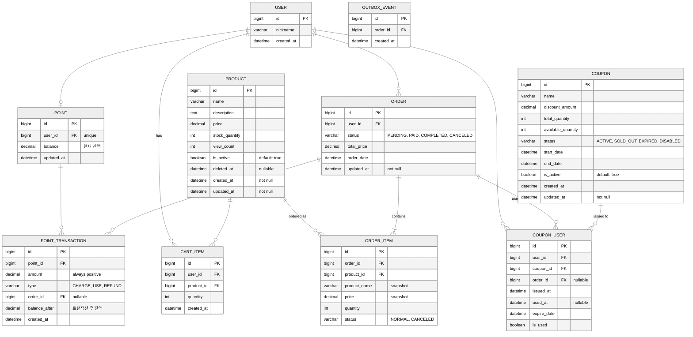

# E-Commerce ERD

#### 01. USER
- 서비스 사용자 정보 테이블
- 닉네임, 생성일 등을 관리

#### 02. POINT
- 사용자별 포인트 계좌 (1:1 관계)
- 현재 잔액과 최근 업데이트 일시 저장

#### 03. POINT_TRANSACTION
- 포인트 거래 내역
- 충전/사용/환불 타입 구분 및 잔액 이력 추적

#### 04. PRODUCT
- 판매 상품 정보
- 이름, 설명, 가격, 재고 수량, 조회 수 등 관리
- Soft Delete: is_active로 삭제 상태 관리
- Audit: 생성일, 수정일, 삭제일 추적

#### 05. CART_ITEM
- 장바구니 아이템 테이블
- 사용자별 담긴 상품과 수량 기록

#### 06. ORDER
- 주문 메인 테이블
- 주문 상태, 총 금액, 주문일 등 포함
- Audit: 주문 상태 변경 추적을 위한 수정일 관리

#### 07. ORDER_ITEM
- 주문 상세 아이템 테이블
- 주문 당시 상품명/가격을 스냅샷 형태로 저장

#### 08. COUPON
- 발행 가능한 쿠폰 정보
- 수량, 기간, 상태 등 관리
- is_active: 쿠폰 활성화/비활성화 관리 (status와 별도로 관리자 제어용)
- Audit: 쿠폰 정보 수정 이력 추적

#### 09. COUPON_USER
- 사용자별 쿠폰 발급/사용 이력
- 사용 여부 및 만료일 관리

#### 10. OUTBOX_EVENT
- 주문 관련 이벤트 발행 내역 저장 (이벤트 소싱용)