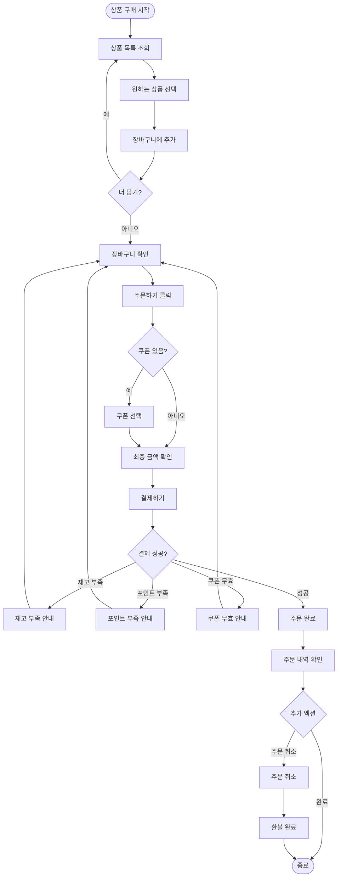
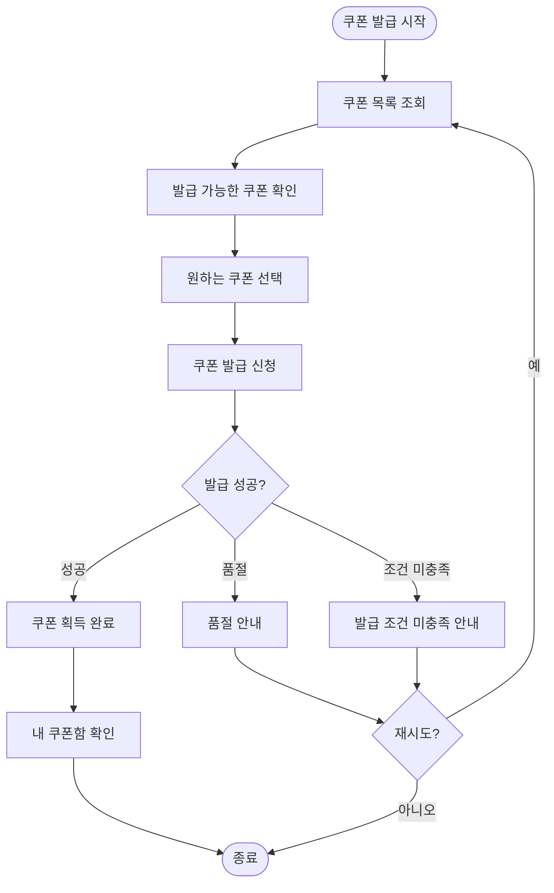
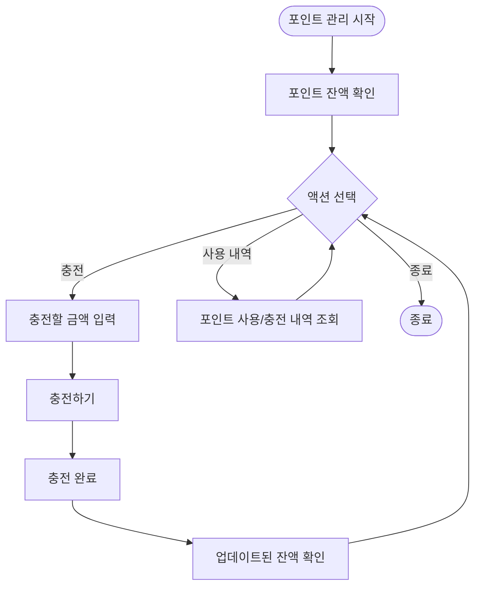

# Flow Chart

## 주문 도메인 - 사용자 관점

```mermaid
flowchart TD
    Start([상품 구매 시작]) --> A[상품 목록 조회]
    A --> B[원하는 상품 선택]
    B --> C[장바구니에 추가]
    C --> D{더 담기?}
    D -->|예| A
    D -->|아니오| E[장바구니 확인]
    E --> F[주문하기 클릭]
    F --> G{쿠폰 있음?}
    G -->|예| H[쿠폰 선택]
    G -->|아니오| I
    H --> I[최종 금액 확인]
    I --> J[결제하기]
    J --> K{결제 성공?}
    K -->|재고 부족| L[재고 부족 안내]
    K -->|포인트 부족| M[포인트 부족 안내]
    K -->|쿠폰 무효| N[쿠폰 무효 안내]
    K -->|성공| O[주문 완료]
    L --> E
    M --> E
    N --> E
    O --> P[주문 내역 확인]
    P --> Q{추가 액션}
    Q -->|주문 취소| R[주문 취소]
    Q -->|완료| End([종료])
    R --> S[환불 완료]
    S --> End
```

## 쿠폰 도메인 - 사용자 관점

```mermaid
flowchart TD
    Start([쿠폰 발급 시작]) --> A[쿠폰 목록 조회]
    A --> B[발급 가능한 쿠폰 확인]
    B --> C[원하는 쿠폰 선택]
    C --> D[쿠폰 발급 신청]
    D --> E{발급 성공?}
    E -->|성공| F[쿠폰 획득 완료]
    E -->|품절| G[품절 안내]
    E -->|조건 미충족| H[발급 조건 미충족 안내]
    F --> I[내 쿠폰함 확인]
    G --> J{재시도?}
    H --> J
    J -->|예| A
    J -->|아니오| End([종료])
    I --> End
```

## 포인트 도메인 - 사용자 관점

```mermaid
flowchart TD
    Start([포인트 관리 시작]) --> A[포인트 잔액 확인]
    A --> B{액션 선택}
    B -->|충전| C[충전할 금액 입력]
    B -->|사용 내역| D[포인트 사용/충전 내역 조회]
    B -->|종료| End([종료])
    C --> E[충전하기]
    E --> F[충전 완료]
    F --> G[업데이트된 잔액 확인]
    G --> B
    D --> B
```