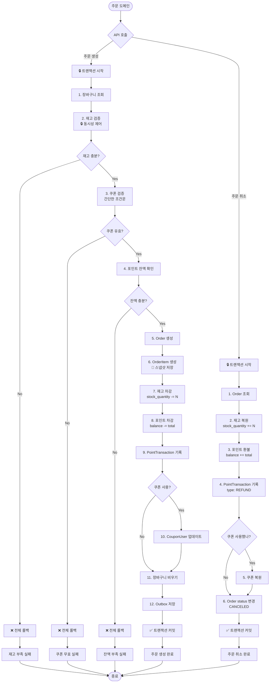
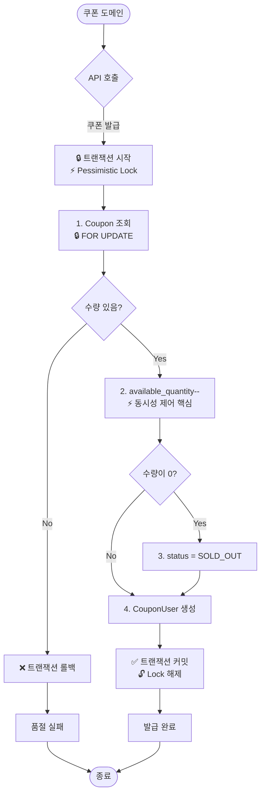
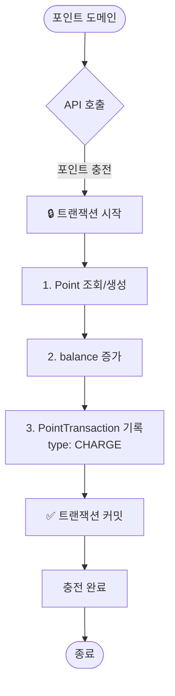

# Flow Chart

## 주문 도메인

```mermaid
flowchart TD
    Start([주문 도메인]) --> Action{API 호출}
    
    Action -->|주문 생성| TxStart[🔒 트랜잭션 시작]
    
    TxStart --> Step1[1. 장바구니 조회]
    Step1 --> Step2[2. 재고 검증<br/>🔒 동시성 제어]
    Step2 --> StockOK{재고 충분?}
    StockOK -->|No| Rollback1[❌ 전체 롤백]
    Rollback1 --> Fail1[재고 부족 실패]
    
    StockOK -->|Yes| Step3[3. 쿠폰 검증<br/>간단한 조건문]
    Step3 --> CouponOK{쿠폰 유효?}
    CouponOK -->|No| Rollback2[❌ 전체 롤백]
    Rollback2 --> Fail2[쿠폰 무효 실패]
    
    CouponOK -->|Yes| Step4[4. 포인트 잔액 확인]
    Step4 --> BalanceOK{잔액 충분?}
    BalanceOK -->|No| Rollback3[❌ 전체 롤백]
    Rollback3 --> Fail3[잔액 부족 실패]
    
    BalanceOK -->|Yes| Step5[5. Order 생성]
    Step5 --> Step6[6. OrderItem 생성<br/>📸 스냅샷 저장]
    Step6 --> Step7[7. 재고 차감<br/>stock_quantity -= N]
    Step7 --> Step8[8. 포인트 차감<br/>balance -= total]
    Step8 --> Step9[9. PointTransaction 기록]
    Step9 --> Step10{쿠폰 사용?}
    Step10 -->|Yes| Step11[10. CouponUser 업데이트]
    Step10 -->|No| Step12
    Step11 --> Step12[11. 장바구니 비우기]
    Step12 --> Step13[12. Outbox 저장]
    Step13 --> TxCommit[✅ 트랜잭션 커밋]
    TxCommit --> Success1[주문 생성 완료]
    
    Action -->|주문 취소| CancelTxStart[🔒 트랜잭션 시작]
    CancelTxStart --> Cancel1[1. Order 조회]
    Cancel1 --> Cancel2[2. 재고 복원<br/>stock_quantity += N]
    Cancel2 --> Cancel3[3. 포인트 환불<br/>balance += total]
    Cancel3 --> Cancel4[4. PointTransaction 기록<br/>type: REFUND]
    Cancel4 --> Cancel5{쿠폰 사용했나?}
    Cancel5 -->|Yes| Cancel6[5. 쿠폰 복원]
    Cancel5 -->|No| Cancel7
    Cancel6 --> Cancel7[6. Order status 변경<br/>CANCELED]
    Cancel7 --> CancelTxCommit[✅ 트랜잭션 커밋]
    CancelTxCommit --> Success2[주문 취소 완료]
    
    Fail1 --> End([종료])
    Fail2 --> End
    Fail3 --> End
    Success1 --> End
    Success2 --> End
```

## 쿠폰 도메인

```mermaid
flowchart TD
    Start([쿠폰 도메인]) --> Action{API 호출}
    
    Action -->|쿠폰 발급| TxStart[🔒 트랜잭션 시작<br/>⚡ Pessimistic Lock]
    
    TxStart --> Step1[1. Coupon 조회<br/>🔒 FOR UPDATE]
    Step1 --> Step2{수량 있음?}
    Step2 -->|No| Rollback[❌ 트랜잭션 롤백]
    Rollback --> Fail[품절 실패]
    
    Step2 -->|Yes| Step3[2. available_quantity--<br/>⚡ 동시성 제어 핵심]
    Step3 --> Step4{수량이 0?}
    Step4 -->|Yes| Step5[3. status = SOLD_OUT]
    Step4 -->|No| Step6
    Step5 --> Step6[4. CouponUser 생성]
    Step6 --> TxCommit[✅ 트랜잭션 커밋<br/>🔓 Lock 해제]
    TxCommit --> Success[발급 완료]
    
    Fail --> End([종료])
    Success --> End
```

## 포인트 도메인

```mermaid
flowchart TD
    Start([포인트 도메인]) --> Action{API 호출}
    
    Action -->|포인트 충전| TxStart[🔒 트랜잭션 시작]
    TxStart --> Step1[1. Point 조회/생성]
    Step1 --> Step2[2. balance 증가]
    Step2 --> Step3[3. PointTransaction 기록<br/>type: CHARGE]
    Step3 --> TxCommit[✅ 트랜잭션 커밋]
    TxCommit --> Success[충전 완료]
    
    Success --> End([종료])
```