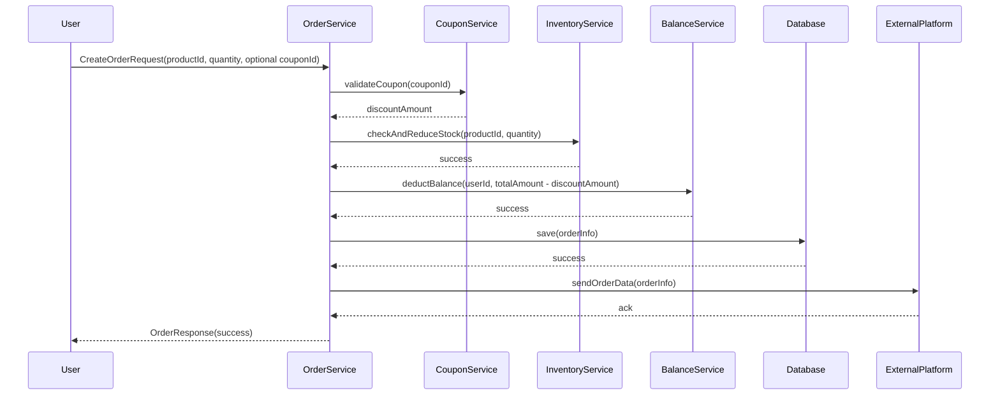
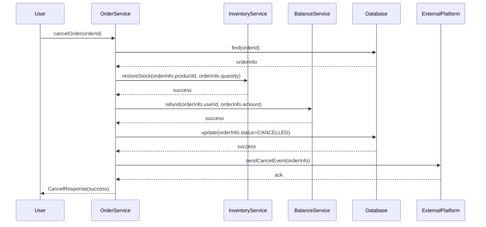
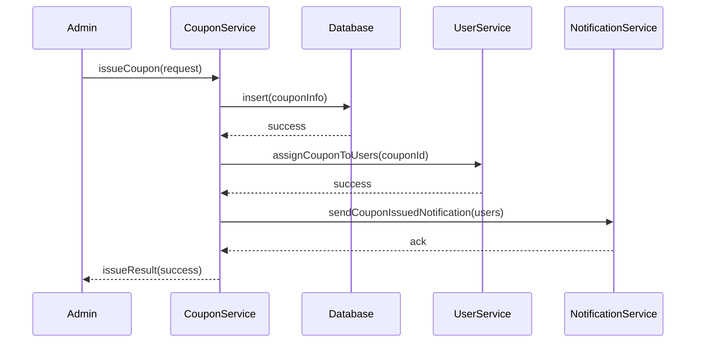
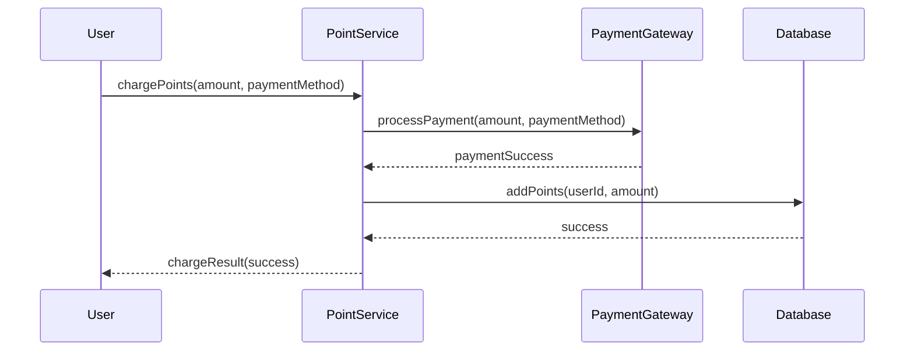

# Sequence Diagrams Documentation

---

## 1️⃣ Create Order Sequence

**요약**
1. 사용자가 상품과 수량을 선택해 주문을 요청한다. 쿠폰 ID는 선택적으로 전달된다.
2. 쿠폰이 있다면, 유효성을 확인하고 할인 금액을 계산한다.
3. 재고 서비스가 재고를 확인하고 차감한다.
4. 잔액 서비스가 사용자 잔액을 차감한다.
5. 주문 정보는 DB에 저장된다.
6. 주문 정보가 외부 데이터 플랫폼에 전송된다.
7. 최종 결과가 사용자에게 반환된다.

---

## 2️⃣ Cancel Order Sequence

**요약**
1. 사용자가 주문 취소를 요청한다.
2. 주문 서비스가 주문 정보를 조회한다.
3. 재고 서비스를 통해 재고를 복원한다.
4. 잔액 서비스를 통해 결제 금액을 환불한다.
5. 주문 상태를 DB에 업데이트한다.
6. 외부 데이터 플랫폼에 취소 이벤트를 전달한다.
7. 최종 결과가 사용자에게 반환된다.

---

## 3️⃣ Issue Coupon Sequence

**요약**
1. 관리자가 쿠폰 발행을 요청한다.
2. 쿠폰 서비스가 쿠폰 정보를 DB에 저장한다.
3. 사용자 서비스가 쿠폰을 사용자에게 할당한다.
4. 알림 서비스가 쿠폰 발행 알림을 발송한다.
5. 결과가 관리자에게 반환된다.

---

## 4️⃣ Charge Point Sequence

**요약**
1. 사용자가 포인트 충전을 요청한다.
2. 결제 게이트웨이를 통해 결제를 처리한다.
3. 결제가 완료되면 포인트 서비스가 DB에 포인트를 적립한다.
4. 최종 결과가 사용자에게 반환된다.
