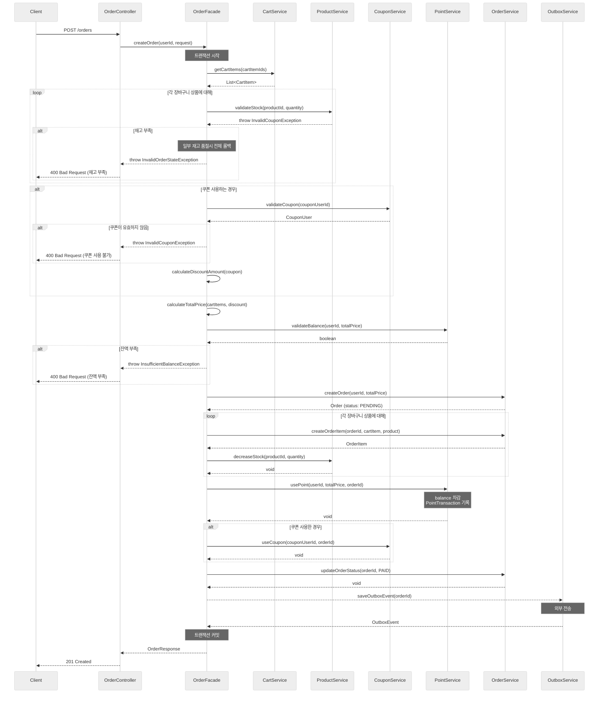
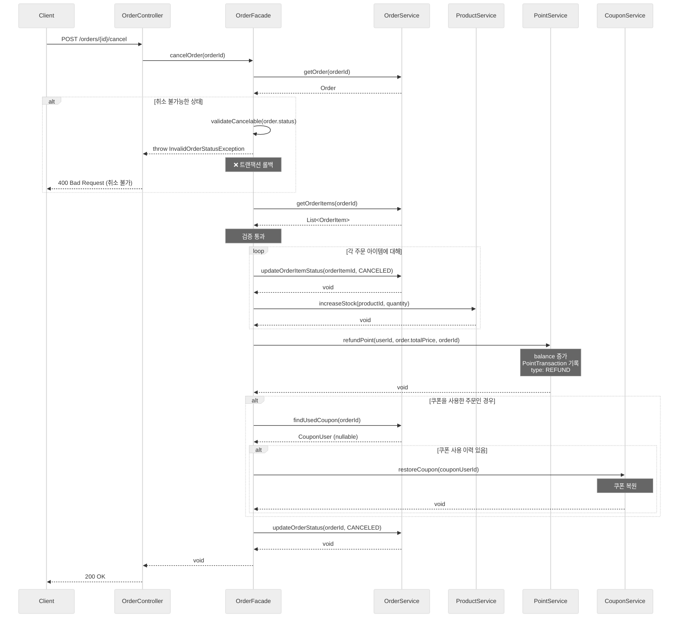
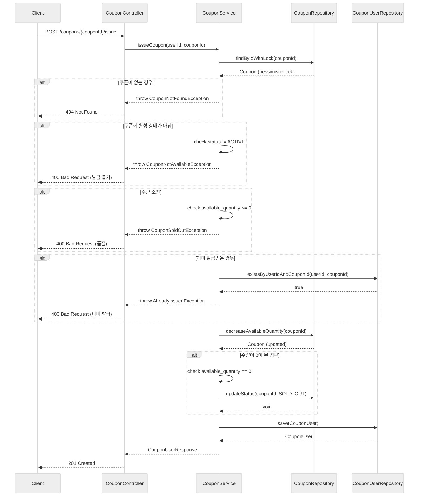
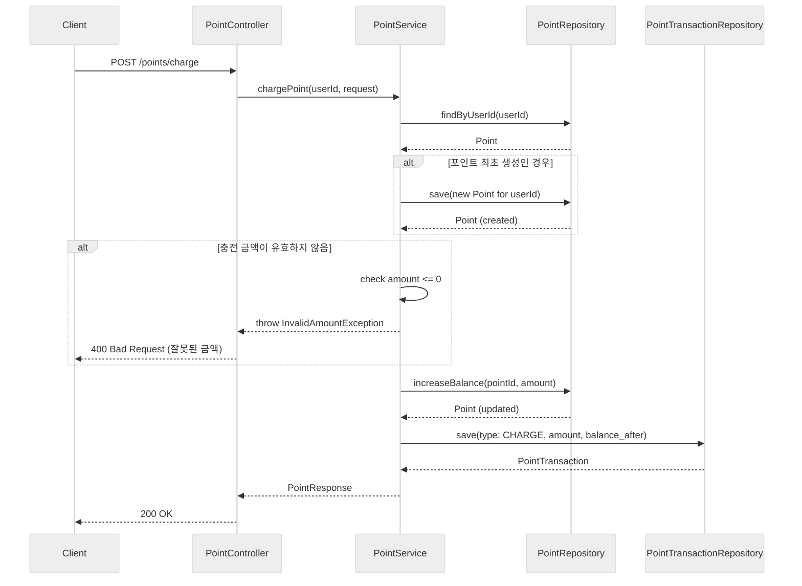

# Sequence Diagrams Documentation

---

## 1. 주문 프로세스 Sequence Diagram

**요약**
1. 사용자가 장바구니 상품을 선택하여 주문을 요청한다. 쿠폰 ID는 선택적으로 전달된다.
2. 장바구니 서비스가 선택된 상품 목록을 조회한다.
3. 각 상품에 대해 재고를 검증하며, 하나라도 재고가 부족하면 전체 주문이 롤백된다.
4. 쿠폰이 있다면 유효성을 검증하고 할인 금액을 계산한다.
5. 총 주문 금액을 계산하고 포인트 잔액이 충분한지 확인한다.
6. 주문과 주문 아이템을 생성하고, 각 상품의 재고를 차감한다.
7. 포인트 서비스가 사용자 잔액을 차감하고 거래 내역을 기록한다.
8. 쿠폰을 사용한 경우 쿠폰 사용 처리를 한다.
9. 주문 상태를 PAID로 변경하고 Outbox 이벤트를 저장하여 외부 시스템에 전송한다.
10. 모든 작업이 성공하면 트랜잭션을 커밋하고 최종 결과를 사용자에게 반환한다.

---

## 2. 주문 취소 Sequence Diagram

**요약**
1. 사용자가 특정 주문에 대해 취소를 요청한다.
2. 주문 정보를 조회하고 취소 가능한 상태인지 검증한다.
3. 취소 불가능한 상태인 경우 예외를 발생시키고 트랜잭션을 롤백한다.
4. 각 주문 아이템의 상태를 CANCELED로 변경하고 상품 재고를 복원한다.
5. 포인트 서비스가 주문 금액을 환불하고 REFUND 타입의 거래 내역을 기록한다.
6. 쿠폰을 사용한 주문인 경우 쿠폰을 복원한다.
7. 주문 상태를 CANCELED로 변경하고 최종 결과를 사용자에게 반환한다.

---

## 3. 선착순 쿠폰 발행 Sequence Diagram

**요약**
1. 사용자가 특정 쿠폰에 대해 발급을 요청한다.
2. Pessimistic Lock으로 쿠폰을 조회하여 동시성 제어를 수행한다.
3. 쿠폰이 존재하지 않거나 활성 상태가 아닌 경우 예외를 발생시킨다.
4. 쿠폰 수량이 소진되었거나 이미 발급받은 경우 예외를 발생시킨다.
5. 쿠폰의 잔여 수량을 1 감소시킨다.
6. 수량이 0이 된 경우 쿠폰 상태를 SOLD_OUT으로 변경한다.
7. 사용자별 쿠폰 발급 정보를 저장하고 최종 결과를 사용자에게 반환한다.

---

## 4. 포인트 충전 Sequence Diagram

**요약**
1. 사용자가 포인트 충전을 요청한다.
2. 사용자의 포인트 계좌를 조회한다.
3. 포인트 계좌가 없는 경우 새로 생성한다.
4. 충전 금액이 0 이하인 경우 예외를 발생시킨다.
5. 포인트 잔액을 충전 금액만큼 증가시킨다.
6. CHARGE 타입의 포인트 거래 내역을 저장하고 최종 결과를 사용자에게 반환한다.